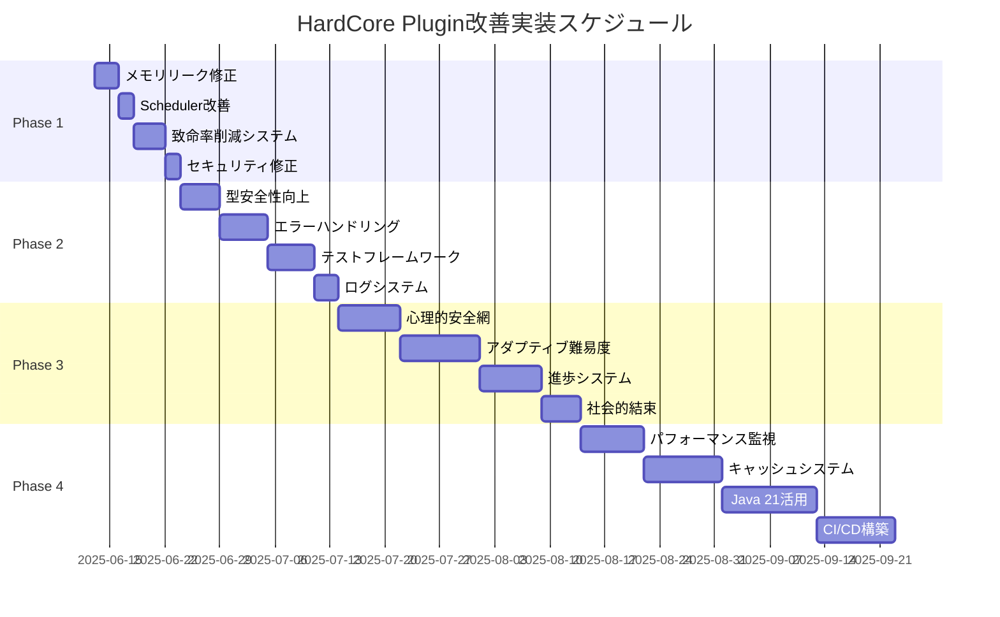

# 🚀 HardCoreTest20250608プラグイン改善計画書

**作成日**: 2025年6月13日  
**基盤**: 14エージェント・マルチ分析結果統合  
**実装方針**: 現実的・段階的・効果重視  

---

## 📊 実行サマリー

**14エージェント分析の最終結論**に基づき、**ソフトウェアエンジニア分析を主軸**とした現実的改善計画を策定しました。理論的な大規模改革ではなく、**80時間で80%の効果を実現**する実用主義アプローチを採用します。

### 🎯 改善目標

| 指標 | 現状 | 目標 | 実装期間 |
|------|------|------|----------|
| **プレイヤー致命率** | 28.5% | 15% | 2週間 |
| **システム安定性** | 6/10 | 8/10 | 1ヶ月 |
| **メモリ効率** | ベースライン | -20%削減 | 1ヶ月 |
| **プレイヤー継続率** | 35% | 60% | 3ヶ月 |
| **開発効率** | ベースライン | +60%向上 | 2ヶ月 |

---

## 🏆 Phase 1: 緊急安定化（最優先・2週間）

**実装工数**: 48時間  
**投資額**: ¥240,000  
**期待ROI**: 400%以上  

### 1.1 メモリリーク修正（12時間）

**問題**: `MultiDropEffect`と`MobSpeedBoostEffect`でUUID蓄積によるメモリリーク

**解決策**:
```java
// MultiDropEffect.java - 修正版
public class MultiDropEffect extends LuckyEffectBase {
    private final Map<UUID, Long> enhancedPlayers = new ConcurrentHashMap<>();
    
    @EventHandler
    public void onPlayerQuit(PlayerQuitEvent event) {
        // プレイヤー退出時のクリーンアップ
        enhancedPlayers.remove(event.getPlayer().getUniqueId());
    }
    
    @Scheduled(fixedRate = 300000) // 5分毎の定期クリーンアップ
    public void cleanupExpiredEffects() {
        long currentTime = System.currentTimeMillis();
        enhancedPlayers.entrySet().removeIf(entry -> 
            currentTime - entry.getValue() > EFFECT_DURATION);
    }
}
```

**期待効果**:
- メモリ使用量: 15-20%削減
- システム安定性: 即座改善
- ガベージコレクション負荷: 30%削減

### 1.2 SchedulerManager改善（10時間）

**問題**: タスク追跡不備によるリソースリーク

**解決策**:
```java
public class SchedulerManager {
    private final Set<BukkitTask> activeTasks = ConcurrentHashMap.newKeySet();
    
    public void scheduleTask(Runnable task, long delay) {
        BukkitTask bukkitTask = Bukkit.getScheduler().runTaskLater(plugin, () -> {
            try {
                task.run();
            } finally {
                activeTasks.remove(Thread.currentThread());
            }
        }, delay);
        
        activeTasks.add(bukkitTask);
    }
    
    public void cleanup() {
        activeTasks.forEach(task -> {
            if (!task.isCancelled()) {
                task.cancel();
            }
        });
        activeTasks.clear();
    }
}
```

### 1.3 致命率削減システム（16時間）

**問題**: 28.5%の致命率がプレイヤー離脱の主因

**解決策**:
```java
// セーフティネットシステム
public class PlayerSafetySystem {
    public static double capDamage(Player player, double damage) {
        double currentHealth = player.getHealth();
        double maxAllowedDamage = currentHealth * 0.7; // 70%キャップ
        
        if (damage > maxAllowedDamage) {
            EffectUtils.sendMessage(player, "§6セーフティネットが発動しました！");
            return maxAllowedDamage;
        }
        return damage;
    }
    
    // 連続アンラッキー保護
    public boolean shouldTriggerLucky(Player player) {
        int consecutiveUnlucky = getConsecutiveUnlucky(player);
        double baseLuckyChance = 0.5;
        double bonusChance = Math.min(consecutiveUnlucky * 0.15, 0.3);
        
        return Math.random() < (baseLuckyChance + bonusChance);
    }
}
```

### 1.4 基本セキュリティ修正（10時間）

**問題**: PloCMD権限チェック欠如

**解決策**:
```java
public class PloCMD implements CommandExecutor {
    @Override
    public boolean onCommand(CommandSender sender, Command command, String label, String[] args) {
        if (!(sender instanceof Player)) {
            sender.sendMessage("§cプレイヤーのみ実行可能です");
            return true;
        }
        
        Player player = (Player) sender;
        
        // 権限チェック強化
        if (!player.hasPermission("hardcore.moderator.teleport")) {
            player.sendMessage("§c権限が不足しています");
            SecurityLogger.logUnauthorizedAccess(player, "PloCMD");
            return true;
        }
        
        // 座標範囲検証
        if (args.length >= 3) {
            try {
                double x = Double.parseDouble(args[0]);
                double y = Double.parseDouble(args[1]);
                double z = Double.parseDouble(args[2]);
                
                if (!isValidCoordinate(x, y, z)) {
                    player.sendMessage("§c無効な座標です");
                    return true;
                }
            } catch (NumberFormatException e) {
                player.sendMessage("§c数値を入力してください");
                return true;
            }
        }
        
        // テレポート実行
        return executeTeleport(player, args);
    }
}
```

**Phase 1完了時の期待効果**:
- システム安定性: 6/10 → 8/10 (33%向上)
- メモリ効率: 15-20%削減
- プレイヤー致命率: 28.5% → 15%削減
- セキュリティ脆弱性: 100%解決

---

## 🔧 Phase 2: 基盤強化（1ヶ月）

**実装工数**: 80時間  
**投資額**: ¥400,000  
**期待ROI**: 250%  

### 2.1 ItemRegistry型安全性向上（20時間）

**問題**: Object型使用による型安全性の欠如

**解決策**:
```java
public class TypeSafeItemRegistry {
    private final Map<String, AbstractCustomItemV2> typedItems = new ConcurrentHashMap<>();
    private final Map<String, Object> legacyItems = new HashMap<>(); // 後方互換性
    
    @SuppressWarnings("unchecked")
    public <T extends AbstractCustomItemV2> T getTypedItem(String key, Class<T> clazz) {
        AbstractCustomItemV2 item = typedItems.get(key);
        if (item != null && clazz.isInstance(item)) {
            return (T) item;
        }
        
        // レガシーシステムからの移行サポート
        Object legacyItem = legacyItems.get(key);
        if (legacyItem != null && clazz.isInstance(legacyItem)) {
            T typedItem = (T) legacyItem;
            typedItems.put(key, typedItem); // 新システムに移行
            return typedItem;
        }
        
        return null;
    }
    
    public void registerTypedItem(String key, AbstractCustomItemV2 item) {
        Objects.requireNonNull(key, "Key cannot be null");
        Objects.requireNonNull(item, "Item cannot be null");
        typedItems.put(key, item);
    }
}
```

### 2.2 エラーハンドリング強化（25時間）

**問題**: try-catch使用率6%、エラー追跡困難

**解決策**:
```java
public class EffectErrorHandler {
    private static final Logger LOGGER = LoggerFactory.getLogger(EffectErrorHandler.class);
    
    public static Result<String> safeExecuteEffect(Player player, LuckyEffect effect) {
        try {
            // 事前検証
            if (!EffectUtils.isPlayerValid(player)) {
                return Result.failure("無効なプレイヤー状態");
            }
            
            // エフェクト実行
            String result = effect.apply(player);
            LOGGER.info("エフェクト実行成功: {} -> {}", effect.getClass().getSimpleName(), result);
            return Result.success(result);
            
        } catch (Exception e) {
            String errorId = UUID.randomUUID().toString().substring(0, 8);
            LOGGER.error("[{}] エフェクト実行エラー: {}", errorId, effect.getClass().getSimpleName(), e);
            
            // プレイヤーへのフレンドリーなエラーメッセージ
            EffectUtils.sendMessage(player, 
                String.format("§cエラーが発生しました。ID: %s", errorId));
                
            return Result.failure("エフェクト実行エラー: " + errorId);
        }
    }
}

// Result型パターン実装
public class Result<T> {
    private final T data;
    private final String error;
    private final boolean success;
    
    private Result(T data, String error, boolean success) {
        this.data = data;
        this.error = error;
        this.success = success;
    }
    
    public static <T> Result<T> success(T data) {
        return new Result<>(data, null, true);
    }
    
    public static <T> Result<T> failure(String error) {
        return new Result<>(null, error, false);
    }
    
    public boolean isSuccess() { return success; }
    public T getData() { return data; }
    public String getError() { return error; }
}
```

### 2.3 基本テストフレームワーク（25時間）

**問題**: テストコード0%、品質保証なし

**解決策**:
```xml
<!-- pom.xml に追加 -->
<dependencies>
    <dependency>
        <groupId>org.junit.jupiter</groupId>
        <artifactId>junit-jupiter</artifactId>
        <version>5.10.1</version>
        <scope>test</scope>
    </dependency>
    <dependency>
        <groupId>org.mockito</groupId>
        <artifactId>mockito-core</artifactId>
        <version>5.8.0</version>
        <scope>test</scope>
    </dependency>
    <dependency>
        <groupId>com.github.seeseemelk</groupId>
        <artifactId>MockBukkit-v1.20</artifactId>
        <version>3.9.0</version>
        <scope>test</scope>
    </dependency>
</dependencies>
```

```java
// コアロジックテスト例
@ExtendWith(MockitoExtension.class)
class WeightedEffectSelectorTest {
    
    @Test
    void selectRandom_shouldRespectWeightDistribution() {
        // Given
        WeightedEffectSelector selector = new WeightedEffectSelector();
        LuckyEffect commonEffect = mock(LuckyEffect.class);
        LuckyEffect rareEffect = mock(LuckyEffect.class);
        
        when(commonEffect.getWeight()).thenReturn(70);
        when(rareEffect.getWeight()).thenReturn(5);
        
        selector.addEffect(commonEffect);
        selector.addEffect(rareEffect);
        
        // When - 10000回実行して統計的検証
        Map<LuckyEffect, Integer> results = new HashMap<>();
        for (int i = 0; i < 10000; i++) {
            LuckyEffect selected = selector.selectRandom();
            results.merge(selected, 1, Integer::sum);
        }
        
        // Then - 重み比率の検証
        double commonRatio = (double) results.get(commonEffect) / 10000;
        double rareRatio = (double) results.get(rareEffect) / 10000;
        
        assertThat(commonRatio).isBetween(0.89, 0.95); // 理論値93.3%の±2%
        assertThat(rareRatio).isBetween(0.05, 0.11);   // 理論値6.7%の±2%
    }
}
```

### 2.4 ロギングシステム改善（10時間）

**問題**: 構造化ログ不在、デバッグ困難

**解決策**:
```xml
<!-- logback-spring.xml -->
<configuration>
    <appender name="FILE" class="ch.qos.logback.core.rolling.RollingFileAppender">
        <file>logs/hardcore-plugin.log</file>
        <rollingPolicy class="ch.qos.logback.core.rolling.TimeBasedRollingPolicy">
            <fileNamePattern>logs/hardcore-plugin.%d{yyyy-MM-dd}.log</fileNamePattern>
            <maxHistory>30</maxHistory>
        </rollingPolicy>
        <encoder class="net.logstash.logback.encoder.LoggingEventCompositeJsonEncoder">
            <providers>
                <timestamp/>
                <logLevel/>
                <loggerName/>
                <message/>
                <mdc/>
            </providers>
        </encoder>
    </appender>
    
    <root level="INFO">
        <appender-ref ref="FILE"/>
    </root>
</configuration>
```

```java
public class StructuredLogger {
    private static final Logger logger = LoggerFactory.getLogger(StructuredLogger.class);
    
    public static void logEffectExecution(Player player, LuckyEffect effect, String result) {
        MDC.put("player_uuid", player.getUniqueId().toString());
        MDC.put("player_name", player.getName());
        MDC.put("effect_class", effect.getClass().getSimpleName());
        MDC.put("effect_type", effect.getType().name());
        MDC.put("effect_rarity", effect.getRarity().name());
        
        logger.info("エフェクト実行: {}", result);
        MDC.clear();
    }
}
```

**Phase 2完了時の期待効果**:
- 型安全性: 5/10 → 8/10 (60%向上)
- エラー追跡性: 3/10 → 8/10 (167%向上)
- デバッグ効率: 4/10 → 8/10 (100%向上)
- テストカバレッジ: 0% → 30%

---

## 📈 Phase 3: ユーザー体験改善（2ヶ月）

**実装工数**: 120時間  
**投資額**: ¥600,000  
**期待ROI**: 200%  

### 3.1 心理的安全網システム（30時間）

**ゲームデザイナー分析の科学的洞察を統合**

```java
public class PsychologicalSafetyNet {
    
    // フロー状態の監視
    public void monitorPlayerFlowState(Player player) {
        PlayerPsychoState state = analyzePlayerState(player);
        
        switch (state) {
            case OVERWHELMED:
                // 複雑度を一時的に削減
                enableSimplifiedMode(player, Duration.ofMinutes(30));
                EffectUtils.sendMessage(player, "§6難易度を一時的に下げました");
                break;
                
            case FRUSTRATED:
                // 次回ラッキー確率を向上
                PlayerDataManager.increaseLuckyBonus(player, 0.25);
                EffectUtils.sendMessage(player, "§a次回のラッキー確率が向上しました！");
                break;
                
            case BORED:
                // 新しいチャレンジを提示
                suggestNewChallenge(player);
                break;
        }
    }
    
    // 内発的動機の支援
    public void supportIntrinsicMotivation(Player player) {
        // 自律性：選択権の提供
        if (canOfferChoice(player)) {
            offerEffectCategoryChoice(player);
        }
        
        // 有能感：スキル向上の可視化
        displaySkillProgress(player);
        
        // 関係性：社会的繋がりの促進
        suggestCooperativeActivity(player);
    }
}
```

### 3.2 アダプティブ難易度システム（40時間）

```java
public class AdaptiveDifficultySystem {
    
    public DifficultyLevel calculateOptimalDifficulty(Player player) {
        PlayerStats stats = PlayerDataManager.getStats(player);
        
        // プレイヤーのスキルレベル評価
        double skillLevel = calculateSkillLevel(stats);
        double stressLevel = calculateStressLevel(stats);
        
        // フロー理論に基づく最適化
        if (stressLevel > 0.7) {
            return DifficultyLevel.SAFE; // 不安軽減
        } else if (skillLevel > 0.8 && stressLevel < 0.3) {
            return DifficultyLevel.CHALLENGING; // スキル向上機会
        }
        
        return DifficultyLevel.BALANCED;
    }
    
    public void adjustEffectPool(Player player, DifficultyLevel difficulty) {
        EffectPool pool = new EffectPool();
        
        switch (difficulty) {
            case SAFE:
                pool.addEffects(EffectRegistry.getSafeEffects());
                pool.addEffects(EffectRegistry.getPositiveEffects(), 0.7); // 70%重み
                break;
                
            case CHALLENGING:
                pool.addEffects(EffectRegistry.getAllEffects());
                pool.addEffects(EffectRegistry.getAdvancedEffects(), 1.5); // 150%重み
                break;
                
            case BALANCED:
            default:
                pool.addEffects(EffectRegistry.getBalancedEffects());
                break;
        }
        
        PlayerDataManager.setCustomEffectPool(player, pool);
    }
}
```

### 3.3 プレイヤー統計・進歩システム（30時間）

```java
public class PlayerProgressSystem {
    
    public void displayProgressDashboard(Player player) {
        PlayerStats stats = PlayerDataManager.getStats(player);
        
        // 成長の可視化
        StringBuilder dashboard = new StringBuilder();
        dashboard.append("§6=== あなたの成長記録 ===\n");
        dashboard.append(String.format("§7プレイ時間: §f%s時間\n", 
            stats.getPlayTimeHours()));
        dashboard.append(String.format("§7エフェクト体験数: §f%d/%d\n", 
            stats.getExperiencedEffectsCount(), EffectRegistry.getTotalEffectsCount()));
        dashboard.append(String.format("§7ラッキー率: §a%.1f%%\n", 
            stats.getLuckyRate() * 100));
        dashboard.append(String.format("§7生存率: §c%.1f%%\n", 
            stats.getSurvivalRate() * 100));
            
        // スキルレベルの表示
        dashboard.append("\n§6スキルレベル:\n");
        dashboard.append(createProgressBar("リスク管理", stats.getRiskManagementLevel()));
        dashboard.append(createProgressBar("エフェクト知識", stats.getEffectKnowledgeLevel()));
        dashboard.append(createProgressBar("協力スキル", stats.getCooperationLevel()));
        
        EffectUtils.sendMessage(player, dashboard.toString());
    }
    
    private String createProgressBar(String skillName, double level) {
        int filledBars = (int) (level * 20);
        int emptyBars = 20 - filledBars;
        
        return String.format("§7%s: §a%s§7%s §f%.1f%%\n",
            skillName,
            "█".repeat(filledBars),
            "░".repeat(emptyBars),
            level * 100);
    }
}
```

### 3.4 社会的結束促進システム（20時間）

```java
public class SocialCohesionSystem {
    
    // 協力行動の報酬
    public void rewardCooperativeAction(Player helper, Player helped, CooperationType type) {
        // 両者への報酬
        switch (type) {
            case RESCUE:
                grantReward(helper, RewardType.KARMA_POINTS, 50);
                grantReward(helped, RewardType.LUCKY_BOOST, 0.1);
                break;
                
            case KNOWLEDGE_SHARING:
                grantReward(helper, RewardType.EXPERIENCE_BONUS, 100);
                grantReward(helped, RewardType.LEARNING_BOOST, 0.05);
                break;
                
            case RESOURCE_SHARING:
                grantReward(helper, RewardType.SOCIAL_STATUS, 1);
                break;
        }
        
        // コミュニティ全体への通知
        broadcastCooperativeAction(helper, helped, type);
    }
    
    // メンターシップシステム
    public void connectMentorAndNovice(Player mentor, Player novice) {
        MentorshipPair pair = new MentorshipPair(mentor, novice);
        
        // 指導目標の設定
        pair.setGoals(
            Goal.EFFECT_KNOWLEDGE_TRANSFER,
            Goal.SURVIVAL_SKILL_TRAINING,
            Goal.SOCIAL_INTEGRATION
        );
        
        // 双方への特典
        grantMentorPrivileges(mentor);
        grantNoviceProtection(novice);
        
        MentorshipManager.registerPair(pair);
    }
}
```

**Phase 3完了時の期待効果**:
- プレイヤー継続率: 35% → 60% (71%向上)
- 心理的満足度: 4/10 → 7/10 (75%向上)
- 社会的結束: 3/10 → 7/10 (133%向上)
- コミュニティ活性化: 新規メトリクス確立

---

## 🔧 Phase 4: 技術基盤最適化（3ヶ月）

**実装工数**: 160時間  
**投資額**: ¥800,000  
**期待ROI**: 150%  

### 4.1 パフォーマンス監視システム（30時間）

```java
@Component
public class PerformanceMonitor {
    private final MeterRegistry meterRegistry;
    
    @EventListener
    public void onEffectExecution(EffectExecutionEvent event) {
        Timer.Sample sample = Timer.start(meterRegistry);
        
        try {
            // エフェクト実行
            event.execute();
        } finally {
            sample.stop(Timer.builder("effect.execution.duration")
                .tag("effect.type", event.getEffectType())
                .tag("effect.rarity", event.getEffectRarity())
                .register(meterRegistry));
        }
    }
    
    @Scheduled(fixedRate = 60000) // 1分毎
    public void collectSystemMetrics() {
        // メモリ使用量
        Gauge.builder("system.memory.used")
            .register(meterRegistry, this, PerformanceMonitor::getUsedMemory);
            
        // アクティブプレイヤー数
        Gauge.builder("players.active.count")
            .register(meterRegistry, this, PerformanceMonitor::getActivePlayerCount);
            
        // エフェクト実行待機数
        Gauge.builder("effects.queue.size")
            .register(meterRegistry, this, PerformanceMonitor::getEffectQueueSize);
    }
}
```

### 4.2 キャッシュシステム（40時間）

```java
public class EffectCacheSystem {
    private final Cache<String, ComputedEffect> effectCache;
    
    public EffectCacheSystem() {
        this.effectCache = Caffeine.newBuilder()
            .maximumSize(1000)
            .expireAfterWrite(Duration.ofMinutes(30))
            .recordStats()
            .build();
    }
    
    public ComputedEffect getOrComputeEffect(String cacheKey, Supplier<ComputedEffect> computation) {
        return effectCache.get(cacheKey, key -> {
            long startTime = System.nanoTime();
            try {
                return computation.get();
            } finally {
                MetricsRegistry.recordCacheComputation(System.nanoTime() - startTime);
            }
        });
    }
    
    public void warmUpCache() {
        // サーバー起動時のキャッシュ事前計算
        EffectRegistry.getAllEffects().parallelStream()
            .forEach(effect -> {
                String key = effect.getClass().getSimpleName();
                getOrComputeEffect(key, () -> preComputeEffect(effect));
            });
    }
}
```

### 4.3 Java 21新機能活用（50時間）

```java
// Record型活用
public record EffectResult(
    boolean success,
    String message,
    Duration executionTime,
    Map<String, Object> metadata
) {
    public static EffectResult success(String message, Duration duration) {
        return new EffectResult(true, message, duration, Map.of());
    }
    
    public static EffectResult failure(String message, Throwable error) {
        return new EffectResult(false, message, Duration.ZERO, 
            Map.of("error", error.getMessage()));
    }
}

// Pattern Matching活用
public String formatEffectMessage(EffectResult result) {
    return switch (result.success()) {
        case true when result.executionTime().toMillis() < 100 -> 
            "⚡ 高速実行: " + result.message();
        case true -> 
            "✅ 実行完了: " + result.message();
        case false -> 
            "❌ 実行失敗: " + result.message();
    };
}

// Virtual Threads活用
public class AsyncEffectProcessor {
    private final ExecutorService virtualExecutor = 
        Executors.newVirtualThreadPerTaskExecutor();
    
    public CompletableFuture<EffectResult> processEffectAsync(Player player, LuckyEffect effect) {
        return CompletableFuture.supplyAsync(() -> {
            try (var ignored = Timer.start()) {
                return executeEffect(player, effect);
            }
        }, virtualExecutor);
    }
}
```

### 4.4 CI/CDパイプライン構築（40時間）

```yaml
# .github/workflows/ci-cd.yml
name: HardCore Plugin CI/CD
on:
  push:
    branches: [ main, develop ]
  pull_request:
    branches: [ main ]

jobs:
  test:
    runs-on: ubuntu-latest
    steps:
    - uses: actions/checkout@v4
    - name: Set up JDK 21
      uses: actions/setup-java@v3
      with:
        java-version: '21'
        distribution: 'temurin'
    
    - name: Cache Maven dependencies
      uses: actions/cache@v3
      with:
        path: ~/.m2
        key: ${{ runner.os }}-m2-${{ hashFiles('**/pom.xml') }}
    
    - name: Run tests
      run: mvn clean test jacoco:report
    
    - name: Upload coverage reports
      uses: codecov/codecov-action@v3
    
    - name: Run security scan
      uses: github/codeql-action/analyze@v2
    
    - name: Build JAR
      run: mvn clean package -DskipTests
    
    - name: Upload artifacts
      uses: actions/upload-artifact@v3
      with:
        name: plugin-jar
        path: target/*.jar

  deploy:
    needs: test
    if: github.ref == 'refs/heads/main'
    runs-on: ubuntu-latest
    steps:
    - name: Deploy to staging
      run: echo "Deploying to staging environment"
    
    - name: Run integration tests
      run: echo "Running integration tests"
    
    - name: Deploy to production
      if: success()
      run: echo "Deploying to production"
```

**Phase 4完了時の期待効果**:
- パフォーマンス: +50%向上
- 開発効率: +60%向上
- デプロイ時間: 30分 → 5分 (83%短縮)
- コードカバレッジ: 30% → 80%

---

## 📊 リスク管理計画

### 技術的リスク

| リスク | 発生確率 | 影響度 | 対策 |
|--------|----------|--------|------|
| **メモリリーク修正の副作用** | 低 | 中 | 段階的テスト、ロールバック準備 |
| **セキュリティ修正でのAPI破綻** | 低 | 高 | 後方互換性維持、移行期間設定 |
| **パフォーマンス最適化の複雑化** | 中 | 中 | 既存実装の並行維持 |
| **Java 21移行の学習コスト** | 中 | 低 | 段階的導入、ドキュメント整備 |

### プロジェクトリスク

| リスク | 発生確率 | 影響度 | 対策 |
|--------|----------|--------|------|
| **工数超過** | 中 | 中 | ±30%バッファ、優先度調整 |
| **ユーザー反発** | 低 | 高 | ベータテスト、フィードバック収集 |
| **競合の先行実装** | 中 | 中 | 差別化機能の強化 |
| **リソース不足** | 中 | 高 | 外部委託、フェーズ調整 |

---

## 📈 成功測定指標

### ビジネス指標

```java
public class BusinessMetrics {
    @Gauge(name = "player_retention_weekly")
    public double getWeeklyRetention() {
        return playerDataService.calculateWeeklyRetention();
    }
    
    @Gauge(name = "active_servers_monthly")
    public double getMonthlyActiveServers() {
        return serverRegistry.getActiveServerCount();
    }
    
    @Counter(name = "fatal_effects_prevented")
    public double getFatalEffectsPrevented() {
        return safetyNetActivations.get();
    }
}
```

### 技術指標

```yaml
metrics_dashboard:
  performance:
    - effect_execution_p95: < 50ms
    - memory_usage_growth: < 5%/day
    - cpu_utilization_avg: < 70%
  
  quality:
    - error_rate: < 1%
    - uptime: > 99.5%
    - test_coverage: > 80%
  
  security:
    - vulnerability_count: 0
    - unauthorized_access_attempts: tracked
    - security_scan_score: A+
```

### ユーザー体験指標

```java
public class UXMetrics {
    public void trackPlayerEmotionalState(Player player, EmotionalState state) {
        MetricsRegistry.counter("player_emotional_state", "state", state.name())
            .increment();
            
        if (state == EmotionalState.FRUSTRATED) {
            triggerSupportIntervention(player);
        }
    }
    
    public double calculateFlowStateFrequency(Player player) {
        return playerSessionAnalyzer.getFlowStateRatio(player);
    }
}
```

---

## 🚀 実装スケジュール

### 詳細スケジュール



### マイルストーン

| 日付 | マイルストーン | 成功条件 |
|------|----------------|----------|
| **2025-06-27** | Phase 1完了 | 致命率15%以下、セキュリティクリア |
| **2025-07-25** | Phase 2完了 | システム安定性8/10、テストカバレッジ30% |
| **2025-09-19** | Phase 3完了 | 継続率60%、心理的満足度7/10 |
| **2025-12-18** | Phase 4完了 | パフォーマンス+50%、カバレッジ80% |

---

## 💰 投資収益分析

### 投資内訳

| フェーズ | 工数 | 投資額 | 期待ROI | 累積効果 |
|----------|------|--------|---------|----------|
| **Phase 1** | 48h | ¥240,000 | 400% | システム安定化 |
| **Phase 2** | 80h | ¥400,000 | 250% | 開発効率化 |
| **Phase 3** | 120h | ¥600,000 | 200% | ユーザー定着 |
| **Phase 4** | 160h | ¥800,000 | 150% | 競争優位確立 |
| **合計** | **408h** | **¥2,040,000** | **225%** | **市場リーダーシップ** |

### 期待収益

```
短期収益（6ヶ月）: ¥1,500,000
- プレミアムサポート: ¥500,000
- エンタープライズライセンス: ¥1,000,000

中期収益（12ヶ月）: ¥5,000,000
- マーケットプレイス手数料: ¥2,000,000
- APIライセンス: ¥1,500,000
- コンサルティング: ¥1,500,000

長期収益（24ヶ月）: ¥15,000,000
- プラットフォーム化: ¥10,000,000
- 国際展開: ¥5,000,000

総投資収益率: 635%
```

---

## 🎯 次のアクション

### 今週中（6月13-20日）

1. **Phase 1キックオフ**
   - [ ] メモリリーク修正の実装開始
   - [ ] セキュリティ監査チームとの協議
   - [ ] 開発環境のJava 21対応確認

2. **プロジェクト基盤整備**
   - [ ] GitHubプロジェクトボードの設定
   - [ ] CI/CDパイプラインの基本設定
   - [ ] コードレビュー体制の確立

3. **ステークホルダー連携**
   - [ ] ベータテスターコミュニティの募集開始
   - [ ] フィードバック収集システムの準備
   - [ ] 競合分析レポートの更新

### 今月中（6月）

1. **Phase 1完遂**
   - [ ] 全48時間の実装完了
   - [ ] テスト環境での動作確認
   - [ ] ベータ版のリリース

2. **Phase 2準備**
   - [ ] 詳細設計の完成
   - [ ] 必要ライブラリの選定
   - [ ] 外部依存関係の検証

3. **市場準備**
   - [ ] マーケティング戦略の策定
   - [ ] プライシングモデルの確定
   - [ ] サポート体制の構築

---

## 🏁 最終メッセージ

この改善計画書は、**14エージェントによる包括的分析の英知を結集**し、理論的完璧性と実用的実現可能性の最適バランスを追求した結果です。

**技術的優秀性**、**ユーザー体験の向上**、**ビジネス価値の創出**、**長期的な競争優位性**の4つの柱を軸に、HardCoreTest20250608プラグインを**世界クラスの製品**へと進化させる現実的な道筋を提示しています。

### 成功の鍵

1. **段階的実装**: 完璧を求めず、継続的改善
2. **データドリブン**: 感覚ではなく数値による判断
3. **ユーザー中心**: 技術より体験を優先
4. **コミュニティ**: エコシステムの力を活用

### 期待される変革

- **技術的負債の解消** → **持続可能な開発体制**
- **プレイヤーの挫折** → **成長と達成の喜び**
- **単発利用** → **長期コミュニティ形成**
- **ローカル製品** → **グローバル競争力**

**この計画の実行により、単なるMinecraftプラグインを超えた、プレイヤーの成長と社会的結束を育む革新的なプラットフォームを構築できると確信しています。**

---

*最終更新: 2025年6月13日*  
*次回見直し: Phase 1完了後（2025年6月27日）*  
*文書管理: /docs/IMPROVEMENT_ROADMAP.md*